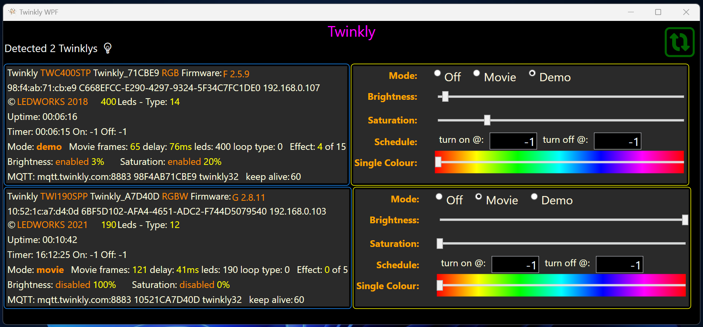

# TwinklyWPF :christmas_tree:
Control Twinkly® RGB Christmas lights with .net 7 GUI and API library 

## About the lights
[Twinkly](https://twinkly.com)® lights are premium consumer RGB (also RGBW and TW) addressable decorations aimed at the Christmas season.
Each set contains 20 to 600 LEDs. They are waterproof enough to use outside.

The wire contains an embedded ARM based dual core controller, that implements its own Wi-Fi endpoint, as well as bluetooth to allow a phone app to provide credentials to access the home wi-fi. Once it is on the local network, it exposes its REST API and will accept some UDP messages. It also connects to an MQTT cloud based broker.

The lights contain a few preprogrammed "effects" and can contain one downloaded "movie". These are selectable by the button on the controller.

You will need the IOs or Android app to connect the lights to the local network, and download any of the premade "movies".
The app is also required for Firmware updates. An account is required to enable the app, but so far they have not sent email to it.

## About the library
The REST API is closed by Twinkly but thankfully documented on [ReadTheDocs](https://xled-docs.readthedocs.io/en/latest/readme.html)

There are several other libraries available on GIThub (see [XLedAPI.cs](https://github.com/MarkAlanJones/TwinklyWPF/blob/main/Twinly_xled/XLedAPI.cs) for the ones I found)
but none were C#.

The library for accessing the REST API is in the [Twinkly_xled project](https://github.com/MarkAlanJones/TwinklyWPF/tree/main/Twinly_xled).

It will attempt to locate the Twinkly lights on the network using a UDP broadcast on port 5555. Currently only the first set of lights found can be controlled.
If the lights are not discovered, power them on and try again. The library does not currently support a hardcoded IP address.

The REST API has 3 functions that can be accessed unauthenticated. 
1. Gestalt
2. Firmware version
3. Login

The Login process seems designed to keep people from controlling the lights directly from a browser URL. There is no secret required.
Any key will be accepted, a challenge is returned, that is passed back to verify to get a token that can be included in the header (and used for real time effects).
The token aways expires after 4hrs. There is currently no Token refresh. Restart to get a new token.

All REST API traffic is over http.

Once Authenticated, the main functions that can be performed are:
1. Set Mode (Off / Movie / Demo / RT)
2. Set Brightness and Saturation
3. Set Current time and enable on and off times 
4. Real Time effects (RT) send a single frame over UDP 7777. (A frame is typically 3 or 4 bytes for each LED in the set, chunked)
5. Get some additional info about the current movie and the lights.

Note that when powered on the lights return to the last mode that was active (usually movie). If you set the timer to turn them off - and then power them off, they will start up in off mode. The current time is not maintained when powered off. (wi-fi settings and MQTT settings are maintained)

Configuring the MQTT broker is not possible ? It's purpose seems to just report back the light's that are active to Ledworks

## About the GUI

The Gui is currently .net 7 WPF (windows only)

Each Twinkly detected gets a row, the left portion shows much of the info that can be retrieved from the API. It is refreshed every 5 seconds.

The right portion allows you to interact with the lights
* Set Mode radio buttons - Off / Movie / Demo 
* Set brightness slider - note that if the lights are 100% - then brightness is disabled
* Set Saturation slider - partial desaturation allows some pastel shades
* Set On Off time - Current time is set automatically. -1 or a parsable time string are valid. Display shifts to 24hr clock when set. (this field implements WPF validation)
* Set Single colour - When the slider stops a single RT frame is sent - setting all lights to the same colour. switch the mode back to resume
* Api also supports a simpler single colour mode, that is not currently enabled in the GUI

## What is missing

* updating Firmware (if you can write your own firmware, I am sure you can deploy it too)
* Create your own movies
* Change MQTT settings. Generation I connected without authentication. MQTT is currently secured, possibly by certificate.
* Network status and Scanning for endpoints is not currently implemented in the library
* Playlist support
* Effects
* Music Drivers

